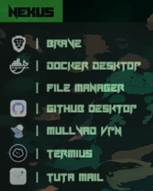

# Custom Rainmeter Launchers

This repository contains two custom Rainmeter launcher `.ini` files designed for a personalized, minimal desktop experience. Below, you’ll find screenshots of each launcher and setup instructions.

## Screenshots

### 1. The Nexus Launcher

### 2. The Funhub Launcher 

## Installation

1. **Move Files**: Copy the `.ini` files into your `Skins` folder within your Rainmeter directory.

2. **Update Paths**: Each launcher points to specific applications. Edit the `.ini` files to match your application paths for the launchers to function as intended.

3. **Customize It**: Make it your own.. Your favorite applications, your preferred fonts and themes. Just have fun with it.

4. **Advice**: In the Rainmeter settings, set the transparency to 80% and add a fade in (on hover) animation. I found that to work best with my wallpaper, specially when positioned on the top left corner, one below the other. Try that out :9

## Support

 If you have any questions, feel free to reach out to me at [xavaby@tuta.io](mailto:xavaby@tuta.io).

 ---

 Enjoy your new Rainmeter launchers!
   
